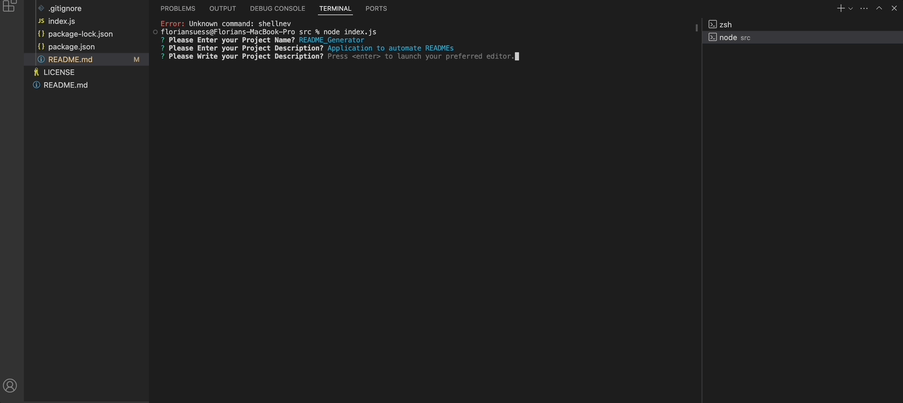
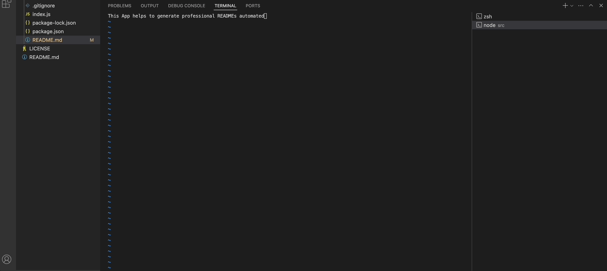
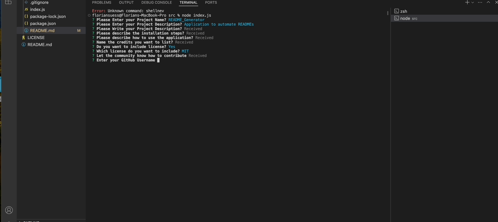
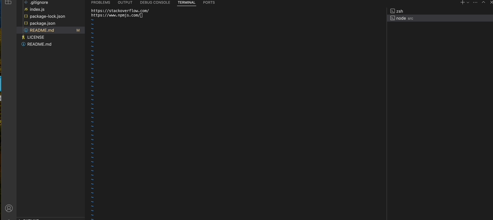
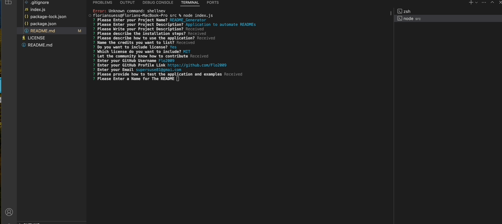
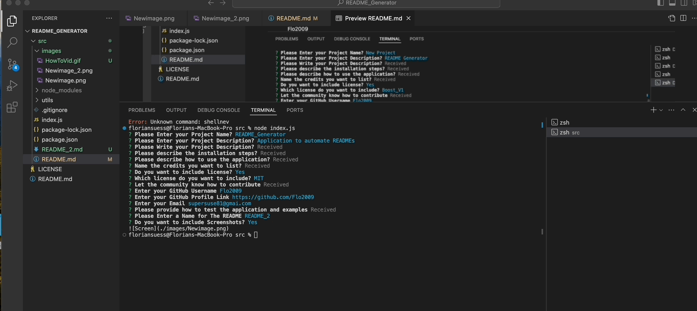

# README_GENERATOR

## Automated README

The intention is to have a application that runs the user through the motions
of a professional README and generates is afterwards. This helps that nothing will be
forgotten on the way and insures the high quality.

## Table of Contents

- [Installation](#installation)
- [Usage](#usage)
- [Credits](#credits)
- [License](#license)
- [Badges](#badges)
- [Contributions](#contributions)
- [Questions](#questions)
- [Tests](#tests)

## Installation

The Installation steps are:
Get the App from my GitHub (link to the repo is below)
Put it in your project folder and cd into it
Once done with the work run "npm install"
Then run node index.js

## Usage

Once installed and launched the command prompt will
walk you through by asking questions
After they are all answered the README is generated

## Credits

https://www.npmjs.com/package/inquirer
https://Stackoverflow.com
https://opensource.org/

## License

https://opensource.org/license/mit

## Badges

## Contributions

Please approach me via eMail (link below) to see how we 
can collaborate

## Questions

Flo2009

https://github.com/Flo2009

supersuse81@gmail.com

## Tests

So far no tests have been generated

