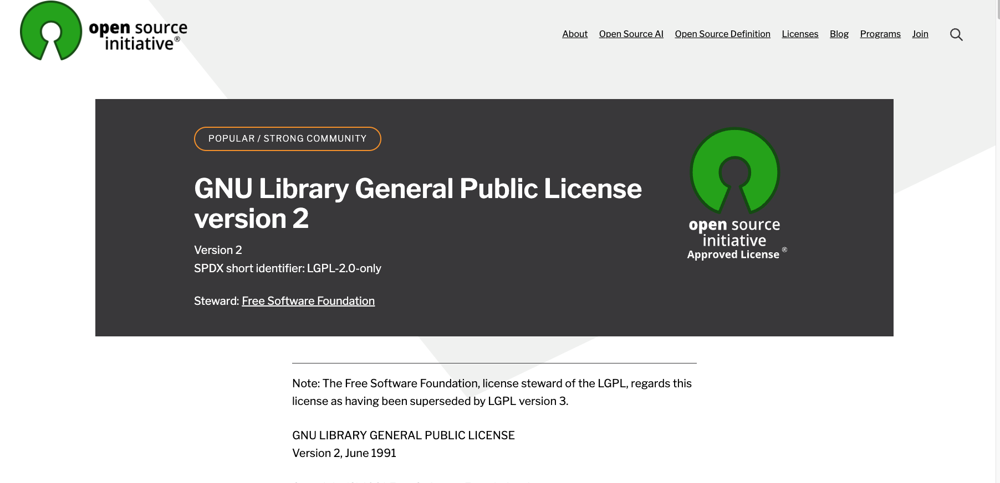

# New Project

## README Generator

Generates a professional README through the command line prompt

## Table of Contents

- [Installation](#installation)
- [Usage](#usage)
- [Credits](#credits)
- [License](#license)
- [Badges](#badges)
- [Contributions](#contributions)
- [Questions](#questions)
- [Tests](#tests)

## Installation

The installation steps:
Download from GitHub
cd into the folder
run npm install
run node index.js

## Usage

Follow the prompt in the console
Give all the necessary information
The README will be generated

## Credits

https://chatgpt.com/
https://www.npmjs.com

## License

https://opensource.org/license/bsl-1-0

## Badges

## Contributions

Write me a mail

## Questions

Flo2009

https://gitub.com/Flo2009

supersuse81@gmail.com

## Tests

no test so far

